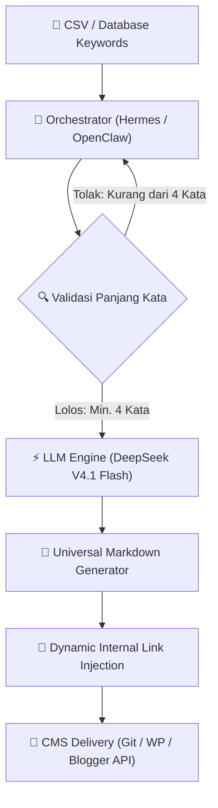

# Ayo SEO — AI Agent Senior SEO & Content Strategist

[](https://opensource.org/licenses/MIT)
[]()
[]()
[]()
[]()

> 💡 **TL;DR / Ringkasan Cepat:**  
> **Ayo SEO** adalah open-source AI Agent plugin untuk **Google Antigravity** yang bertindak sebagai *Senior SEO Specialist & Content Strategist*. Didesain khusus untuk memproduksi artikel berstandar **Google E-E-A-T**, membangun hierarki **Topical Authority** (Pilar, Cluster, Glossary), serta mengoptimalkan konten untuk mesin pencari konvensional (Google Search) maupun mesin pencari generatif (**GEO & AEO** seperti Google AI Overviews, Perplexity, dan ChatGPT Search).

---

## 📌 Sekilas Tentang Ayo SEO (Entity Snapshot)

| Parameter | Spesifikasi & Arsitektur |
| :--- | :--- |
| **Kategori** | AI Agent Plugin / SEO Strategy & Content Generation Engine |
| **Platform Host** | Google Antigravity IDE & Antigravity CLI |
| **Model LLM Optimal** | Gemini 3.1 Pro (Pilar) & Gemini 3.8 Flash (Cluster & Glossary) |
| **Standar Kualitas** | Google Helpful Content System, Quality Rater Guidelines (QRG), E-E-A-T |
| **Target Engine** | SERP Tradisional (Google, Bing) + AI Engines (Perplexity, Google AI Overviews, ChatGPT Search) |
| **Format Output** | Universal Markdown siap posting (termasuk Slug, Meta Title, Alt Text, Key Takeaways, FAQ) |
| **Integrasi CMS** | Headless Git-based (Keystatic, PagesCMS), WordPress REST API, Blogger API v3 |

---

## 🌟 Kenapa Ayo SEO? (GEO & Information Gain)

Di era *Google Helpful Content System* dan menjamurnya *AI Search Engines*, memproduksi artikel menggunakan AI biasa sering kali menghasilkan teks klise (*AI slop*) yang rawan de-indexing dan diabaikan oleh mesin pencari generatif. 

**Ayo SEO memecahkan masalah ini dengan mengedepankan Information Gain dan riset berbasis entitas:**

### Perbandingan: Generator AI Biasa vs. Ayo SEO

| Aspek Evaluasi | Generator Konten AI Biasa | Ayo SEO (Senior Specialist Mode) |
| :--- | :--- | :--- |
| **Alur Kerja** | Langsung membuat artikel tanpa analisis mendalam | Melakukan riset Search Intent, Entity Mapping, dan gap kompetitor sebelum menulis |
| **Hierarki Konten** | Artikel acak tanpa arsitektur SEO | Membangun ekosistem *Topical Authority* (Pilar ⇄ Cluster ⇄ Glossary) |
| **Gaya Bahasa (Tone)** | Kaku dan klise (*"Di era digital saat ini...", "Kesimpulannya..."*) | Bahasa santai, mengalir natural ("aku-kamu"), humanis, tanpa *wall-of-text* |
| **Strategi Judul** | Sering memakai clickbait murahan atau judul generik | **Hook Penasaran Etis (Curiosity Gap)**: CTR tinggi dan janji ditepati (anti *pogo-sticking*) |
| **GEO / AEO Ready** | Format polos tanpa struktur kutipan AI | Dilengkapi **Key Takeaways (TL;DR)** & **Skema FAQ** siap kutip oleh AI Search |
| **Link Building** | Tautan acak atau spam internal link | Outbound link otoritatif (Dofollow) & strategi anchor text deskriptif |

---

## 🚀 3 Mode Produksi Konten (Content Architecture)

Ayo SEO menyediakan 3 mode terstruktur untuk membangun hierarki website yang mendominasi mesin pencari:

### 1. 🏛️ Mode Pilar (Pillar Post)
- **Fungsi:** Panduan komprehensif, luas, dan mendalam (2.500 – 4.000+ kata) yang memayungi sebuah topik besar industri.
- **Standar E-E-A-T:** Wajib mengutip riset otoritatif internasional (Dofollow) dan menyertakan rekomendasi topik artikel cluster pendukung.
- **Model Rekomendasi:** `Gemini 3.1 Pro (High)` untuk penalaran E-E-A-T maksimal.

### 2. 🎯 Mode Cluster (Supporting Post)
- **Fungsi:** Pembahasan tajam dan spesifik (1.200 – 2.000 kata) yang menjawab satu masalah detail (*long-tail keywords* 4+ kata).
- **Tugas Utama:** Membangun *Internal Link* kembali ke Artikel Pilar untuk menyalurkan *PageRank* dan memperkuat *Topical Authority*.
- **Model Rekomendasi:** `Gemini 3.8 Flash (High)` (cepat, tajam, dan hemat token).

### 3. 📖 Mode Glossary (Kamus Istilah)
- **Fungsi:** Penjelasan definisi ringkas (500 – 800 kata) yang ramah pemula untuk menjawab intent "Apa itu X".
- **Tugas Utama:** Menjembatani pengunjung awal (*awareness stage*) ke artikel pilar atau halaman penawaran produk/layanan agar menekan *bounce rate*.
- **Model Rekomendasi:** `Gemini 3.8 Flash (High)`.

---

## ⚡ Slash Commands & Efisiensi Token

Gunakan perintah jalan pintas (*slash commands*) langsung di prompt chat Antigravity untuk melewati tahap tanya jawab:

| Command | Fungsi Utama | Rekomendasi Model LLM |
| :--- | :--- | :--- |
| `/ayo-seo` | **General Router** (Konsultasi ide, riset intent, edukasi keyword) | Fleksibel |
| `/ayo-seo-pilar [Topik]` | Langsung eksekusi **Artikel Pilar** komprehensif | **Gemini 3.1 Pro (High)** |
| `/ayo-seo-cluster [Topik]`| Langsung eksekusi **Artikel Cluster** spesifik | **Gemini 3.8 Flash (High)** |
| `/ayo-seo-glossary [Istilah]`| Langsung eksekusi **Artikel Glossary** ringkas | **Gemini 3.8 Flash (High)** |

**Contoh Penggunaan Langsung:**
```text
/ayo-seo-cluster Cara daftar YouTube Shopping Affiliate Shopee untuk pemula
```

---

## 🎯 Standar Optimasi GEO & AEO (Generative Engine Optimization)

Agar konten yang diproduksi Ayo SEO mudah dikutip dan direferensikan oleh mesin pencari AI (**Google AI Overviews, Perplexity, ChatGPT Search, Copilot**), sistem menerapkan standar struktural:

1. **Intisari Instan (Key Takeaways / TL;DR):**  
   Diletakkan tepat di awal artikel dalam format poin berbobot fakta/data. Ini menjadi umpan kutipan langsung bagi AI search engine untuk ditampilkan sebagai jawaban instan.
2. **FAQ Berbasis Search Intent:**  
   Format pertanyaan menggunakan gaya percakapan natural manusia (*conversational search queries*), dengan jawaban ringkas 2–3 kalimat langsung ke sasaran.
3. **Teknik Curiosity Gap Beretika:**  
   Judul H1 dan Meta Title dirancang memantik rasa penasaran alami tanpa clickbait palsu, menjaga retensi pengunjung dan mencegah sinyal negatif *pogo-sticking*.
4. **Universal Semantic Hierarchy:**  
   Heading terstruktur logis (H1, H2, H3), paragraf pendek (2–3 kalimat), tabel perbandingan, serta saran visual dan Alt Text ramah aksesibilitas.

---

## 🤖 Arsitektur Autopilot & Programmatic SEO (Blueprint Hermes / OpenClaw)

Ayo SEO tidak hanya dirancang untuk penulisan manual via chat, melainkan disiapkan penuh untuk ekosistem **Autonomous Agentic Orchestrator** (seperti **Hermes** atau **OpenClaw**) jika kamu ingin menjalankan mesin *Programmatic SEO* tanpa pengawasan manusia (*autopilot*) di masa depan.



### 1. The Autopilot Stack
- **Agentic Orchestrator:** Hermes / OpenClaw (sebagai *task manager* dan *runner* antrean).
- **LLM Engine:** **DeepSeek V4.1 Flash** (dipilih karena kecepatan ekstrem, biaya token super hemat, dan penalaran logis tajam untuk *search intent* informasional).
- **Target CMS:** Keystatic, PagesCMS, WordPress, atau Blogger.
- **Sistem Keamanan Default (Anti-Penalti):** Sistem autopilot di-kunci 100% untuk memproduksi **Artikel Cluster (Evergreen Content)** saja. Otomatisasi penuh untuk artikel berita (*news*) atau review komersial tanpa *Human-in-the-Loop* berisiko tinggi terkena penalti E-E-A-T Google, sehingga pembatasan ini dibuat untuk menjaga integritas domainmu.

---

### 2. Tiga Aturan Emas Eksekusi (Execution Guardrails)

#### 🛡️ Rule #1: WAJIB Long-Tail Keyword (Minimal 4 Kata)
Agar otomatisasi menghasilkan trafik yang pasti dan terhindar dari bias intent, *Orchestrator* **hanya boleh** mengeksekusi keyword dengan panjang minimal 4 kata:
- ✅ **Valid:** `"cara riset keyword youtube shopping"` (5 kata).
- ❌ **Ditolak:** `"youtube shopping"` (2 kata — terlalu luas dan ambigu).
*Alasan: Keyword 4+ kata memiliki search intent yang sangat jernih (informasional/edukasional), sehingga AI tidak memproduksi konten "sampah" yang tidak relevan.*

#### 🛡️ Rule #2: Struktur Universal Markdown
DeepSeek V4.1 Flash menghasilkan format Markdown murni yang kompatibel dengan **SEMUA jenis CMS** tanpa dependensi custom code:
1. **Paragraf 1 (TL;DR Organik):** Langsung menyajikan jawaban instan dalam teks tebal (*bold*) sebagai umpan *Featured Snippets* (tanpa kalimat pembuka klise).
2. **Body (Step-by-Step):** Menggunakan *bullet points* atau *numbered list* standar.
3. **Information Gain (Konteks Praktisi):** Menyisipkan pola bahasa pengalaman manusia (*"Masalah umum yang sering terjadi di lapangan adalah..."*).
4. **FAQ Organik:** 3 pertanyaan turunan menggunakan format H3, dengan H2 wajib bertuliskan persis: **Pertanyaan Yang Sering Diajukan (FAQ)**.

#### 🛡️ Rule #3: Internal Linking Dinamis (The Spider Web)
Tugas utama mesin autopilot adalah mengalirkan otoritas (*PageRank*) ke Artikel Pilar:
- Di akhir setiap artikel cluster otomatis, Agent wajib menyisipkan paragraf *call-to-action* (CTA) natural.
- CTA ini memuat *Internal Link* menuju Artikel Pilar target.
- **Konfigurasi URL Dinamis:** URL pilar **TIDAK BOLEH di-hardcode**. Orchestrator menyuplai URL target secara dinamis (*prompt parameter injection*) saat antrean dieksekusi.

---

### 3. Alur Kerja Eksekusi 6 Langkah (Execution Flow)

1. **[Trigger]** Sistem membaca file `CSV` atau database berisi daftar ratusan *long-tail keywords*.
2. **[Validation]** Orchestrator memvalidasi panjang kata (hanya memproses keyword > 3 kata).
3. **[Research]** Agent (opsional) melakukan *web scraping* kilat untuk mengekstrak sudut pandang (*angle*) dari 3 hasil teratas SERP.
4. **[Generation]** DeepSeek V4.1 Flash memproduksi artikel Cluster sesuai aturan *Universal Markdown*.
5. **[Delivery / CMS Integration]** Mengirimkan hasil posting otomatis via 3 opsi integrasi:
   - **Git-Based (PagesCMS / Keystatic):** Push otomatis file `.md` langsung ke repository GitHub menggunakan GitHub API.
   - **WordPress REST API:** Posting otomatis ke endpoint `POST /wp-json/wp/v2/posts` via *Application Password*.
   - **Google Blogger API v3:** Posting otomatis ke endpoint `POST /v3/blogs/{blogId}/posts`.
6. **[Loop]** Orchestrator otomatis melanjutkan ke baris antrean keyword berikutnya.

> Seluruh arsitektur ini juga terdokumentasi terpisah di file [rules/AUTOPILOT_ARCHITECTURE.md](rules/AUTOPILOT_ARCHITECTURE.md).

---

## 📦 Panduan Instalasi

Pasang plugin Ayo SEO ke lingkungan Antigravity lokalmu dengan langkah mudah:

```bash
# 1. Clone repositori Ayo SEO
git clone https://github.com/andrean-lp/ayo-seo.git

# 2. Salin ke folder plugin Antigravity
cp -r ayo-seo ~/.gemini/config/plugins/ayo-seo
```

*Restart Antigravity untuk langsung mengaktifkan kemampuan Senior SEO Specialist.*

---

## ❓ Pertanyaan Yang Sering Diajukan (FAQ)

### Apa bedanya Ayo SEO dengan prompt penulisan artikel biasa di ChatGPT?
Ayo SEO bukan sekadar generator teks sekali pakai. Ini adalah agent strategis dengan SOP baku: melakukan riset search intent, memetakan entitas semantik, menjaga standar Google E-E-A-T, mengatur link building editorial dofollow yang aman, serta memformat output khusus untuk ramah kutipan AI (GEO/AEO).

### Bagaimana cara Ayo SEO menjaga artikel agar tidak terkena penalti Google?
Ayo SEO menerapkan prinsip *People-First Content*: menghilangkan pola kalimat klise AI, menambahkan wawasan praktis (*Information Gain*), melarang clickbait murahan yang memicu *pogo-sticking*, serta menjaga format keterbacaan tinggi dengan paragraf pendek dan spasi lega.

### Mengapa mode Cluster dan Glossary direkomendasikan memakai Gemini 3.8 Flash?
Karena artikel Cluster dan Glossary fokus pada subtopik atau definisi yang sempit. Memakai Gemini 3.8 Flash memberikan kecepatan eksekusi tinggi dan efisiensi konsumsi token yang signifikan, namun tetap menghasilkan tulisan tajam berstandar SEO tinggi.

---

## 📝 Changelog Terbaru

- **v1.7.0 (2026-10-10):** Optimasi GEO & AEO repositori secara menyeluruh. Standarisasi pembuatan judul artikel dengan teknik *Hook Penasaran (Curiosity Gap)* beretika untuk mendongkrak CTR di SERP, serta larangan keras *deceptive clickbait* murahan guna mencegah sinyal negatif *pogo-sticking* pada *Google Helpful Content System*.
- **v1.6.3:** Standarisasi teks H2 bagian FAQ menjadi persis `Pertanyaan Yang Sering Diajukan (FAQ)` di seluruh rules.
- **v1.6.2:** Penerapan aturan ketat jarak spasi paragraf dan panjang kalimat (anti *wall of text*).
- **v1.6.1:** Format wajib *Title Case* untuk Meta Title di seluruh mode artikel.
- **v1.6.0:** Dukungan integrasi API CMS untuk WordPress REST API dan Blogger API v3.
- **v1.5.4:** Klarifikasi alur *Git-based delivery* untuk Keystatic dan PagesCMS.
- **v1.4.0:** Perombakan dokumentasi menjadi SEO Playbook komprehensif.

---

## 📄 Lisensi
Didistribusikan secara open-source di bawah lisensi [MIT License](LICENSE).
