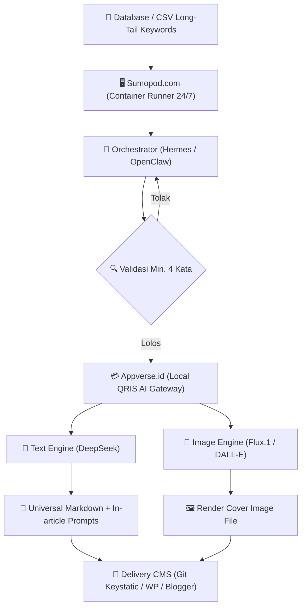

# Ayo SEO — AI Agent Senior SEO & Content Strategist

[](https://opensource.org/licenses/MIT)
[]()
[]()
[]()
[]()
[-emerald.svg)]()

> 💡 **TL;DR / Ringkasan Cepat:**  
> **Ayo SEO** adalah open-source AI Agent plugin untuk **Google Antigravity** yang bertindak sebagai *Senior SEO Specialist & Content Strategist*. Didesain khusus untuk memproduksi artikel berstandar **Google E-E-A-T**, membangun hierarki **Topical Authority** (Pilar, Cluster, Glossary), serta mendistribusikan konten (*Repurposing*) ke media sosial dan infografis visual. Teroptimasi penuh untuk mesin pencari konvensional (Google Search) maupun mesin pencari generatif (**GEO & AEO** seperti Google AI Overviews, Perplexity, dan ChatGPT Search).

---

## 📌 Sekilas Tentang Ayo SEO (Entity Snapshot)

| Parameter | Spesifikasi & Arsitektur |
| :--- | :--- |
| **Kategori** | AI Agent Plugin / SEO Strategy, Content Generation & Visual Repurposing Engine |
| **Platform Host** | Google Antigravity IDE & Antigravity CLI |
| **Model LLM Optimal** | Gemini 3.1 Pro (Pilar) & Gemini 3.8 Flash (Cluster, Glossary, Repurpose) |
| **Standar Kualitas** | Google Helpful Content System, Quality Rater Guidelines (QRG), E-E-A-T |
| **Target Engine** | SERP Tradisional (Google, Bing) + AI Search Engines (Perplexity, Google AI Overviews, ChatGPT Search) |
| **Format Output** | Universal Markdown siap posting (termasuk Slug, Meta Title Title Case, Key Takeaways, FAQ Schema, Prompt DALL-E 3) |
| **Standar Visual** | **Syar'i Compliant (Default):** Karakter manusia *faceless* (tanpa mata, alis, hidung, mulut) & dilarang menampilkan hewan |
| **Integrasi CMS** | Headless Git-based (Keystatic, PagesCMS), WordPress REST API, Blogger API v3 |
| **Autopilot Stack** | Sumopod.com (Container Host) + Appverse.id (Local QRIS Gateway) + DeepSeek + Flux/DALL-E |

---

## 🌟 Kenapa Ayo SEO? (GEO & Information Gain)

Di era *Google Helpful Content System* dan menjamurnya *AI Search Engines*, memproduksi artikel menggunakan AI biasa sering kali menghasilkan teks klise (*AI slop*) yang rawan de-indexing dan diabaikan oleh mesin pencari generatif. 

**Ayo SEO memecahkan masalah ini dengan mengedepankan Information Gain, riset berbasis entitas, dan ekosistem multi-format:**

### Perbandingan: Generator AI Biasa vs. Ayo SEO

| Aspek Evaluasi | Generator Konten AI Biasa | Ayo SEO (Senior Specialist Mode) |
| :--- | :--- | :--- |
| **Alur Kerja** | Langsung membuat artikel tanpa analisis mendalam | Riset Search Intent, Entity Mapping, dan gap kompetitor sebelum menulis |
| **Hierarki Konten** | Artikel acak tanpa arsitektur SEO | Membangun ekosistem *Topical Authority* (Pilar ⇄ Cluster ⇄ Glossary) |
| **Gaya Bahasa (Tone)** | Kaku dan klise (*"Di era digital saat ini...", "Kesimpulannya..."*) | Bahasa santai, mengalir natural ("aku-kamu"), humanis, tanpa *wall-of-text* |
| **Strategi Judul** | Sering memakai clickbait murahan atau judul generik | **Hook Penasaran Etis (Curiosity Gap)**: CTR tinggi dan janji ditepati (anti *pogo-sticking*) |
| **GEO / AEO Ready** | Format polos tanpa struktur kutipan AI | Dilengkapi **Key Takeaways (TL;DR)** & **Skema FAQ** siap kutip oleh AI Search |
| **Visual & Gambar** | Tidak ada arahan visual atau menyarankan foto stock pasaran | Menyertakan **Prompt DALL-E 3 siap salin** (Inline + Cover 16:9) berstandar syar'i |
| **Distribusi Konten** | Berhenti setelah artikel teks selesai | Fitur **Content Repurposing** ke Carousel IG (3:4), Single Image AEO (3:4), & Infografis (9:16) |

---

## 🚀 6 Kemampuan Utama (Core Features & Skills)

Ayo SEO menyediakan rangkaian *skills* lengkap untuk kebutuhan produksi hingga distribusi konten:

### 1. 🏛️ Mode Pilar (`/ayo-seo-pilar [Topik]`)
- **Fungsi:** Panduan komprehensif, luas, dan mendalam (2.500 – 4.000+ kata) yang memayungi topik besar industri.
- **Struktur Ahli:** Dilengkapi Daftar Isi (*Table of Contents*) ber-anchor links, konsep *10x Pillar Page* / *Resource Hub*, validasi persona audiens & topik *evergreen*.
- **Visual Otomatis:** Otomatis menghasilkan **Prompt Cover Artikel 16:9** dan prompt DALL-E gambar sisipan di sela-sela teks.
- **Standar E-E-A-T:** Wajib mengutip riset otoritatif internasional (Dofollow) dan menyertakan rekomendasi topik cluster pendukung.
- **Rekomendasi Model:** `Gemini 3.1 Pro (High)`.

### 2. 🎯 Mode Cluster (`/ayo-seo-cluster [Topik]`)
- **Fungsi:** Pembahasan tajam dan spesifik (1.200 – 2.000 kata) yang menjawab satu masalah detail (*long-tail keywords* 4+ kata).
- **Tugas Utama:** Membangun *Internal Link* kembali ke Artikel Pilar untuk menyalurkan *PageRank* dan memperkuat *Topical Authority*.
- **Visual Otomatis:** Menghasilkan prompt cover artikel 16:9 dan prompt gambar pendukung di dalam artikel.
- **Rekomendasi Model:** `Gemini 3.8 Flash (High)`.

### 3. 📖 Mode Glossary (`/ayo-seo-glossary [Istilah]`)
- **Fungsi:** Penjelasan definisi ringkas (500 – 800 kata) yang ramah pemula untuk menjawab search intent "Apa itu X".
- **Tugas Utama:** Menjembatani pengunjung awal (*awareness stage*) ke artikel pilar atau penawaran produk untuk menekan *bounce rate*.
- **Rekomendasi Model:** `Gemini 3.8 Flash (High)`.

### 4. 📱 Repurpose Content (`/ayo-seo-repurpose-content`)
- **Fungsi:** Memecah artikel panjang menjadi micro-content viral untuk media sosial berbasis **Content Atomization**.
- **Alur Interaktif:** Agen menganalisis artikel dan menawarkan 3–5 sudut pandang (*angles*), pilihan format, serta gaya visual melalui modal interaktif.
- **2 Pilihan Format:**
  1. **Carousel IG/LinkedIn (6 Slide, Rasio 3:4):** Mengikuti formula storytelling Storiq (*Hook -> Problem -> Solusi 1-3 -> CTA*), lengkap dengan prompt copywriting, prompt visual DALL-E, caption SEO, dan Alt Text.
  2. **Single Image AEO (Rasio 3:4):** Gambar berfokus pada tipografi tebal pertanyaan (Hook), sedangkan jawaban tuntas disajikan di kolom caption agar diindeks Google sebagai referensi AEO.

### 5. 📊 Infografis Vertikal (`/ayo-seo-infografis`)
- **Fungsi:** Merangkum poin inti artikel menjadi prompt pembuatan **Infografis Vertikal (Rasio 9:16)**.
- **Kegunaan:** Sangat cocok disisipkan di badan artikel blog agar tidak monoton (*anti wall-of-text*) atau di-pin ke Pinterest untuk menjaring *backlink* organik.

### 6. 🖼️ Cover Artikel Generator (`/ayo-seo-cover`)
- **Fungsi:** Generator prompt DALL-E 3 khusus untuk *Featured Image* blog dengan aspek rasio **16:9 (Landscape)**.
- **Prinsip Bersih:** Diinstruksikan tegas tanpa teks di dalam gambar (*No Text/Typography*) untuk menghindari cacat halusinasi typo AI.
- **Guardrail E-E-A-T:** Memberikan peringatan otomatis agar menggunakan foto asli jika artikel membahas review produk fisik/kuliner.

---

## ⚡ Daftar Lengkap Slash Commands

| Command | Fungsi Utama | Rasio Visual Default | Rekomendasi Model |
| :--- | :--- | :---: | :--- |
| `/ayo-seo` | **General Router** (Konsultasi ide, pemilihan pilar/cluster/glossary) | - | Fleksibel |
| `/ayo-seo-pilar [Topik]` | Membuat **Artikel Pilar** komprehensif + Cover 16:9 | 16:9 | **Gemini 3.1 Pro (High)** |
| `/ayo-seo-cluster [Topik]` | Membuat **Artikel Cluster** pendukung + Cover 16:9 | 16:9 | **Gemini 3.8 Flash (High)** |
| `/ayo-seo-glossary [Istilah]`| Membuat **Artikel Glossary** ringkas | - | **Gemini 3.8 Flash (High)** |
| `/ayo-seo-repurpose-content` | Repurpose artikel ke **Carousel (6 Slide)** atau **Single Image AEO** | 3:4 (Portrait) | **Gemini 3.8 Flash (High)** |
| `/ayo-seo-infografis` | Merangkum artikel menjadi prompt **Infografis Vertikal** | 9:16 (Story) | **Gemini 3.8 Flash (High)** |
| `/ayo-seo-cover` | Membuat prompt DALL-E khusus **Cover Artikel (Featured Image)** | 16:9 (Landscape) | **Gemini 3.8 Flash (High)** |

---

## 🕋 Standar Visual Syar'i (Faceless & Tanpa Hewan)

Ayo SEO memiliki aturan global terikat pada `rules/AGENTS.md` mengenai kepatuhan visual:
1. **Dilarang Menampilkan Hewan:** Seluruh prompt gambar DALL-E yang dihasilkan agen tidak akan menyertakan hewan jenis apa pun.
2. **Karakter Tanpa Wajah (Faceless Illustration):** Jika prompt memuat karakter manusia, agen **wajib mutlak** menambahkan instruksi tegas agar digambar dalam gaya *faceless* (wajah kosong sepenuhnya: tanpa mata, tanpa alis, tanpa hidung, dan tanpa mulut).
3. **Status:** Aturan ini bersifat **default dan selalu aktif** demi kenyamanan pengguna muslim tanpa mengurangi estetika modern (*3D Clay, Minimalist Vector, Isometric*).

---

## 🎯 Standar Optimasi GEO & AEO (Generative Engine Optimization)

Agar konten mudah dikutip oleh mesin pencari AI (**Google AI Overviews, Perplexity, ChatGPT Search**), Ayo SEO menyematkan parameter wajib:

1. **Intisari Instan (Key Takeaways / TL;DR):**  
   Diletakkan tepat di awal artikel dengan prinsip *Bottom Line Up Front (BLUF)* sebagai umpan kutipan langsung AI.
2. **FAQ Berbasis Conversational Search:**  
   Pertanyaan menggunakan bahasa pencarian alami manusia dengan jawaban padat (2–3 kalimat langsung ke sasaran). Bagian ini dilengkapi panduan pemasangan Schema `FAQPage`.
3. **Teknik Curiosity Gap Beretika:**  
   H1 dan Meta Title (50–60 karakter berformat *Title Case*) memantik rasa penasaran tanpa clickbait manipulatif guna mencegah *pogo-sticking*.
4. **Social SEO Loop:**  
   Memanfaatkan pengindeksan media sosial oleh Google Search Console melalui konten repurposing yang kaya *keyword* dan *Alt Text*.

---

## 🤖 Arsitektur Autopilot & Programmatic SEO (Blueprint Masa Depan)

Ayo SEO dirancang siap pakai untuk ekosistem *Autonomous Agentic Orchestrator* (seperti **Hermes** atau **OpenClaw**) dengan infrastruktur ramah developer Indonesia (pembayaran lokal QRIS):



### Komponen Autopilot Stack:
- **Runner Host:** **Sumopod.com** (Container / Cloud management lokal untuk *runtime* skrip antrean 24/7).
- **API Gateway (Proxy):** **Appverse.id** (AI Gateway lokal pendukung QRIS/GoPay tanpa perlu kartu kredit internasional).
- **LLM Engine (Brain):** **DeepSeek** (Efisien, cepat, dan penalaran logis tajam untuk artikel informasional).
- **Image Engine (Renderer):** **Flux.1 / Stable Diffusion** via Appverse untuk menghasilkan file gambar cover otomatis.
- **Target CMS:** Keystatic (Git Push), WordPress REST API, atau Blogger API v3.
- **Sistem Keamanan:** Terkunci 100% pada artikel cluster *Evergreen* (min. 4 kata) guna melindungi reputasi E-E-A-T domain.

> Seluruh panduan teknis ini tercatat di [rules/AUTOPILOT_ARCHITECTURE.md](rules/AUTOPILOT_ARCHITECTURE.md).

---

## 📦 Panduan Instalasi

Pasang plugin Ayo SEO ke Antigravity lokalmu:

```bash
# 1. Clone repositori Ayo SEO
git clone https://github.com/andrean-lp/ayo-seo.git

# 2. Salin ke folder plugin Antigravity
cp -r ayo-seo ~/.gemini/config/plugins/ayo-seo
```

*Restart Antigravity IDE atau buka sesi baru untuk mengaktifkan seluruh kemampuan Ayo SEO.*

---

## ❓ Pertanyaan Yang Sering Diajukan (FAQ)

### Apa bedanya Ayo SEO dengan prompt penulisan artikel biasa di ChatGPT?
Ayo SEO bukan sekadar generator teks sekali pakai. Ini adalah agen terstruktur dengan SOP lengkap: riset search intent, entity mapping semantik, E-E-A-T guideline, sistem linking editorial dofollow, aturan visual syar'i faceless, hingga pembuatan prompt turunan media sosial.

### Mengapa gambar di Ayo SEO menggunakan format prompt DALL-E siap salin?
Google sangat mengutamakan orisinalitas dan *Information Gain*. Menggunakan foto stock gratisan (Unsplash/Pexels) rawan dianggap duplikat oleh Google Vision API. Dengan membuat prompt unik DALL-E (atau merendernya via API), aset visual websitemu 100% unik dan bernilai SEO tinggi.

### Apakah postingan Instagram dari hasil repurpose benar-benar terindeks Google?
Ya! Google Search Console kini secara resmi mendukung pemantauan akun sosial media (Instagram, TikTok, X, YouTube). Kalimat pertama pada caption dan Alt Text yang dihasilkan Ayo SEO dirancang khusus agar diindeks Google Search.

---

## 📝 Ringkasan Versi Terbaru (Changelog Highlights)

- **v1.15.0 (2026-10-10):** Penambahan skill `/ayo-seo-cover` (Prompt Cover 16:9 tanpa teks), serta pembuatan prompt cover otomatis pada metadata artikel pilar dan cluster.
- **v1.14.1:** Penyesuaian rasio default Single Image AEO menjadi `3:4 (Portrait)` untuk keterbacaan optimal di layar smartphone.
- **v1.14.0:** Penambahan format Single Image AEO (pertanyaan di visual, jawaban lengkap di caption) pada fitur repurpose.
- **v1.13.0:** Pembuatan caption Instagram SEO-friendly dan Alt Text otomatis pada fitur repurpose carousel.
- **v1.12.1:** Standardisasi rasio visual bawaan: Carousel 3:4 dan Infografis 9:16.
- **v1.12.0:** Penambahan skill `/ayo-seo-infografis` (Infografis vertikal) dan injeksi prompt gambar otomatis di badan artikel.
- **v1.11.0:** Pembaruan sistem *Content Atomization* pada repurpose (memecah 1 artikel menjadi 3–5 pilihan sudut pandang).
- **v1.10.0:** Penerapan aturan global **Standar Visual Syar'i** (Faceless illustration & tanpa hewan) di seluruh agen dan skill.
- **v1.9.0:** Peluncuran skill `/ayo-seo-repurpose-content` berbasis alur 6 slide Storiq.
- **v1.8.0:** Peningkatan Artikel Pilar berbasis wawasan pakar (Daftar Isi anchor links, 10x Pillar/Hub concept, persona evergreen).
- **v1.7.0:** Optimasi GEO & AEO repositori secara menyeluruh serta teknik judul *Curiosity Gap* etis.

---

## 📄 Lisensi
Didistribusikan secara open-source di bawah lisensi [MIT License](LICENSE).
